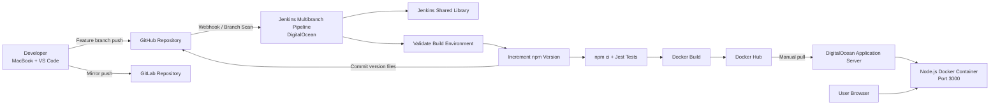
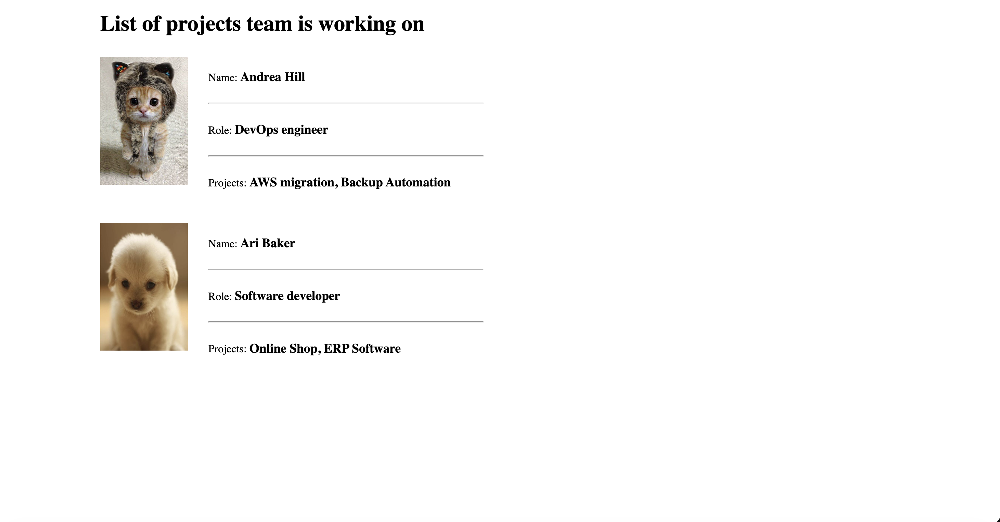
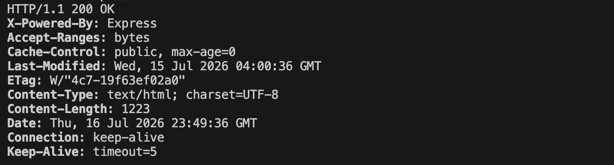

# Node.js Jenkins CI/CD Pipeline

A production-aware CI/CD portfolio project that uses Jenkins Multibranch Pipeline, Docker, Docker Hub, GitHub, GitLab, Jest, and a reusable Jenkins Shared Library to test, version, package, and publish a Node.js application.

---

## Table of Contents

- [Project Overview](#project-overview)
- [Objectives](#objectives)
- [Architecture](#architecture)
- [Pipeline Flow](#pipeline-flow)
- [Technology Stack](#technology-stack)
- [Repository Structure](#repository-structure)
- [Local Development](#local-development)
- [Docker Usage](#docker-usage)
- [Versioning Strategy](#versioning-strategy)
- [Jenkins Configuration](#jenkins-configuration)
- [Jenkins Shared Library](#jenkins-shared-library)
- [DigitalOcean Deployment](#digitalocean-deployment)
- [Security Practices](#security-practices)
- [Project Evidence](#project-evidence)
- [Git Workflow](#git-workflow)
- [Key Engineering Decisions](#key-engineering-decisions)
- [Rollback Procedure](#rollback-procedure)
- [Troubleshooting](#troubleshooting)
- [Future Improvements](#future-improvements)
- [Attribution](#attribution)
- [Author](#author)

---

## Project Overview

This project implements a complete continuous integration workflow for a Node.js and Express application that displays developers and their associated projects.

Every qualifying Git change is detected by a Jenkins Multibranch Pipeline. Jenkins then:

1. Checks out the active branch.
2. validates the required build tools.
3. increments the npm application version.
4. installs locked dependencies using `npm ci`.
5. runs automated Jest tests.
6. builds a Docker image.
7. applies immutable and rolling Docker tags.
8. authenticates securely to Docker Hub.
9. pushes the image to Docker Hub.
10. commits the updated npm version files back to the active release branch.

Reusable pipeline logic is maintained in a separate Jenkins Shared Library repository so that application repositories can use standardized CI/CD functions without duplicating Groovy code.

The published Docker image can then be pulled and deployed manually to a secured DigitalOcean server.

---

## Objectives

- Dockerize a Node.js application.
- Run automated Jest tests in Jenkins.
- stop the pipeline immediately when tests fail.
- increment the npm minor version automatically.
- create immutable Docker image tags.
- maintain a rolling `latest` Docker image tag.
- push Docker images to Docker Hub securely.
- commit `package.json` and `package-lock.json` version changes.
- prevent Jenkins-generated commits from creating an infinite build loop.
- use a Jenkins Multibranch Pipeline.
- extract reusable pipeline logic into a Jenkins Shared Library.
- deploy a tested image manually to DigitalOcean.
- maintain synchronized GitHub and GitLab repositories.
- preserve meaningful Git history using feature branches and non-fast-forward merges.
- document implementation evidence for portfolio and interview use.

---

## Architecture



### Architecture Summary

| Component | Responsibility |
|---|---|
| Developer workstation | Feature development, testing, Git commits, and branch management |
| GitHub | Primary source repository and Jenkins integration |
| GitLab | Secondary repository mirror |
| Jenkins | Pipeline orchestration and CI automation |
| Jenkins Shared Library | Reusable Groovy pipeline functions |
| Jest | Automated application testing |
| Docker | Application packaging |
| Docker Hub | Container image registry |
| DigitalOcean | Jenkins host and application deployment environment |

---

## Pipeline Flow

```text
Checkout source code
        ↓
Load Jenkins Shared Library
        ↓
Validate Node.js, npm, Docker, and Git
        ↓
Increment npm minor version
        ↓
Read application version from package.json
        ↓
Create immutable Docker image tag
        ↓
Install dependencies with npm ci
        ↓
Run Jest tests
        ↓
Build Docker image
        ↓
Authenticate to Docker Hub
        ↓
Push immutable and latest tags
        ↓
Commit package.json and package-lock.json
        ↓
Push version commit to the active release branch
```

### Failure Behaviour

The pipeline stops when a required stage fails. For example:

- dependency installation failure prevents testing and image publishing;
- test failure prevents Docker build and registry publishing;
- Docker authentication failure prevents image push;
- GitHub authentication failure prevents the automated version commit.

---

## Technology Stack

| Category | Technology |
|---|---|
| Application | Node.js, Express |
| Testing | Jest |
| CI/CD | Jenkins Multibranch Pipeline |
| Pipeline language | Groovy |
| Pipeline reuse | Jenkins Shared Library |
| Containerization | Docker |
| Container registry | Docker Hub |
| Source control | Git |
| Primary repository | GitHub |
| Secondary repository | GitLab |
| Cloud infrastructure | DigitalOcean |
| Authentication | Jenkins Credentials, GitHub PAT, Docker Hub access token |
| Server security | SSH keys, UFW, Fail2ban |
| Documentation | Markdown, Mermaid |

---

## Repository Structure

```text
.
├── app/
│   ├── images/
│   ├── index.html
│   ├── package.json
│   ├── package-lock.json
│   ├── server.js
│   └── server.test.js
├── docs/
│   └── screenshots/
│       ├── 01-local-jest-test.png
│       ├── 02-local-docker-build.png
│       ├── 02.1_docker_hub_images_version_builds.png
│       ├── 03-jenkins-multibranch-configuration.png
│       ├── 04-successful-pipeline-stage-view.png
│       ├── 05_jenkins_shared_library_class.png
│       ├── 06_response_success.png
│       ├── 07_rollback_to_previous_build_version.png
│       ├── 08_production_release_.png
├── .dockerignore
├── .gitignore
├── Dockerfile
├── Jenkinsfile
└── README.md
```

> Screenshot file names are examples. Update the Markdown image paths if your actual files use different names.

---

## Local Development

### Prerequisites

Install the following tools:

- Node.js
- npm
- Docker
- Git

### Clone the Repository

```bash
git clone git@github.com:younghadiz/nodejs-jenkins-cicd-pipeline.git
cd nodejs-jenkins-cicd-pipeline
```

### Install Dependencies

```bash
cd app
npm ci
```

### Run Tests

```bash
npm test -- --runInBand
```

### Start the Application

```bash
npm start
```

Open the application in a browser:

```text
http://localhost:3000
```

---

## Docker Usage

Run these commands from the repository root.

### Build the Image

```bash
docker build \
  --tag younghadiz/nodejs-jenkins-cicd:local \
  .
```

### Run the Container

```bash
docker run \
  --rm \
  --name nodejs-jenkins-cicd-local \
  --publish 3000:3000 \
  younghadiz/nodejs-jenkins-cicd:local
```

### Verify the Application

```bash
curl -I http://localhost:3000
```

### Stop the Container

When running without `--rm`:

```bash
docker stop nodejs-jenkins-cicd-local
docker rm nodejs-jenkins-cicd-local
```

---

## Versioning Strategy

The pipeline increments the npm minor version without creating an npm-generated Git tag or commit:

```bash
npm version minor --no-git-tag-version
```

Example:

```text
1.3.0 → 1.4.0
```

Jenkins combines the application version with the Jenkins build number:

```text
1.4.0-13
```

The pipeline publishes two Docker tags:

```text
younghadiz/nodejs-jenkins-cicd:1.4.0-13
younghadiz/nodejs-jenkins-cicd:latest
```

### Tag Purpose

| Tag type | Example | Purpose |
|---|---|---|
| Immutable | `1.4.0-13` | Identifies an exact application and Jenkins build |
| Rolling | `latest` | Identifies the most recently published successful image |

Production deployments should use the immutable tag instead of relying only on `latest`.

---

## Jenkins Configuration

### Required Plugins

The Jenkins controller requires plugins such as:

- Pipeline
- Multibranch Pipeline
- Git
- GitHub Branch Source
- Credentials Binding
- NodeJS
- Pipeline Utility Steps
- Docker Pipeline, where applicable
- Ignore Committer Strategy, where configured

### Required Global Tool

Configure the Node.js installation under:

```text
Manage Jenkins
→ Tools
→ NodeJS installations
```

Example tool name:

```text
Node24
```

The tool name must match the value used in the Jenkinsfile.

### Jenkins Credentials

The pipeline expects the following Jenkins credential IDs:

| Credential ID | Jenkins type | Purpose |
|---|---|---|
| `github-token` | Username with password | GitHub checkout, shared-library access, and version commit push |
| `docker-credentials` | Username with password | Docker Hub authentication and image publishing |

> If your Jenkins credential currently uses another ID such as `dockerhub-creds`, either rename the credential usage in the shared library or pass the credential ID as a configurable parameter. The Jenkinsfile, shared library, and Jenkins credential store must use the same ID.

Credential values are never stored in this repository.

### Commit Loop Prevention

Jenkins commits updated version files back to GitHub. The multibranch configuration should ignore commits authored only by Jenkins.

Example Jenkins commit identity:

```text
Jenkins CI <jenkins@example.com>
```

This prevents the automated version commit from immediately starting another build and creating an endless version-increment loop.

---

## Jenkins Shared Library

Reusable pipeline logic is stored in a separate repository:

```text
https://github.com/younghadiz/jenkins-nodejs-shared-library
```

The shared library centralizes commonly repeated CI/CD operations.

### Reusable Functions

```groovy
incrementNpmVersion()
runNodeTests()
buildAndPushNodeImage()
commitNpmVersion()
```

### Shared Library Benefits

- reduces Jenkinsfile duplication;
- standardizes CI/CD behaviour across repositories;
- centralizes security-sensitive pipeline logic;
- simplifies maintenance;
- supports version-controlled pipeline functions;
- makes future pipeline improvements reusable.

### Jenkinsfile Library Declaration

Example:

```groovy
@Library('jenkins-nodejs-shared-library@main') _
```

For production environments, pinning the shared library to a release tag is safer than always tracking `main`.

Example:

```groovy
@Library('jenkins-nodejs-shared-library@v1.0.0') _
```

---

## DigitalOcean Deployment

The project currently supports manual deployment of a tested, immutable image.

### Pull a Versioned Image

```bash
docker pull younghadiz/nodejs-jenkins-cicd:<tag>
```

Example:

```bash
docker pull younghadiz/nodejs-jenkins-cicd:1.4.0-13
```

### Remove an Existing Container

```bash
docker stop nodejs-developer-projects 2>/dev/null || true
docker rm nodejs-developer-projects 2>/dev/null || true
```

### Start the New Container

```bash
docker run \
  --detach \
  --name nodejs-developer-projects \
  --restart unless-stopped \
  --publish 3000:3000 \
  younghadiz/nodejs-jenkins-cicd:1.4.0-13
```

### Verify the Container

```bash
docker ps
docker logs nodejs-developer-projects
curl -I http://127.0.0.1:3000
```

---

## Security Practices

- Jenkins secrets are stored in Jenkins Credentials.
- GitHub PATs and Docker Hub tokens are never committed.
- Docker Hub access uses an access token instead of an account password.
- credentials are injected only during the stage that needs them.
- shell tracing is disabled around secret-handling commands.
- the Docker image runs using a non-root application user.
- SSH password authentication is disabled.
- root SSH login is disabled after validating a secondary administrative user.
- DigitalOcean Cloud Firewall and UFW restrict inbound traffic.
- Fail2ban helps reduce automated SSH attacks.
- npm version files are explicitly staged instead of using `git add .`.
- Jenkins-authored commits are excluded from automatic rebuilds.
- immutable Docker tags support auditability and controlled rollback.
- screenshots are sanitized before publication.
- tokens, private IP addresses, email addresses, and infrastructure identifiers are redacted.
- shared-library source code is reviewed before it is trusted by Jenkins.
- production pipelines should pin shared libraries to version tags.

---

## Project Evidence

The screenshots below are displayed separately from the repository structure so that reviewers can quickly evaluate the implementation.

> Store sanitized screenshots in `docs/screenshots/`. Never publish passwords, access tokens, private keys, session cookies, credential values, or sensitive infrastructure details.

### 1. Local Jest Test Success

Demonstrates that the application test suite passes before CI execution.



---

### 2. Local Docker Build

Demonstrates that the application is successfully packaged as a Docker image.



---

### 3. Local Application Test

Demonstrates that the containerized application is accessible through a browser.


---

### 4. Jenkins Multibranch Configuration

Demonstrates GitHub integration, repository discovery, credentials configuration, and branch-specific pipeline execution.


---

### 5. Jenkins Shared Library Configuration

Demonstrates that Jenkins is configured to retrieve reusable pipeline logic from the dedicated shared-library repository.


---

### 6. Successful Jenkins Pipeline Stage View

Demonstrates successful completion of validation, versioning, testing, Docker build, registry publishing, and Git version commit stages.


---

### 7. Successful Jenkins Console Output

Demonstrates the final successful build status and the versioned Docker image published by the pipeline.


---

### 8. Docker Hub Versioned Tags

Demonstrates immutable version tags and the rolling `latest` tag in Docker Hub.


---

### 9. DigitalOcean Running Container

Demonstrates the published image running as a Docker container on the deployment server.


---

### 10. Deployed Application

Demonstrates the application running successfully from the deployed Docker image.


---

## Git Workflow

```text
main
└── develop
    ├── feature/dockerize-nodejs-app
    ├── feature/jenkins-ci-pipeline
    ├── feature/validate-ci-trigger
    └── feature/jenkins-shared-library
```

### Branch Roles

| Branch | Purpose |
|---|---|
| `main` | Production-ready release history |
| `develop` | Integration branch for completed features |
| `feature/*` | Isolated implementation work |

### Feature Merge

Feature branches are merged into `develop` using:

```bash
git switch develop
git merge --no-ff feature/<feature-name>
```

### Production Release

The tested `develop` branch is merged into `main`:

```bash
git switch main
git pull github main
git merge --no-ff develop -m "release: merge develop into main for production"
git push github main
git push gitlab main
```

### Repository Synchronization

After Jenkins creates an automated version commit on GitHub:

```bash
git pull github develop
git push gitlab develop
```

For `main`:

```bash
git pull github main
git push gitlab main
```

---

## Key Engineering Decisions

### Why Jenkins Multibranch Pipeline?

It automatically discovers repository branches that contain a Jenkinsfile and provides branch-specific pipeline execution.

### Why `npm ci`?

`npm ci` installs dependencies from `package-lock.json`, producing a deterministic CI build and failing when the lock file is inconsistent with `package.json`.

### Why Run Tests Before Publishing?

Publishing is allowed only after tests pass. This prevents known-broken code from being packaged and pushed to the image registry.

### Why Immutable Docker Tags?

A tag such as `1.4.0-13` identifies the exact application version and Jenkins build. This supports auditability, troubleshooting, reproducibility, and rollback.

### Why Keep the `latest` Tag?

The `latest` tag provides a convenient reference to the most recently published successful image. It is useful for development but should not replace immutable tags in controlled production deployments.

### Why Use a Jenkins Shared Library?

The shared library removes repeated Groovy code from application repositories and provides centrally maintained pipeline functions.

### Why Ignore Jenkins Committers?

Jenkins commits npm version changes. Without an ignore strategy, that commit could trigger another pipeline, increment the version again, and create an endless build loop.

### Why Maintain GitHub and GitLab?

GitHub serves as the primary Jenkins-integrated repository, while GitLab provides a secondary synchronized repository and demonstrates multi-remote Git management.

---

## Rollback Procedure

List recently published tags in Docker Hub, then select the last known-good immutable image.

On the DigitalOcean application server:

```bash
docker stop nodejs-developer-projects
docker rm nodejs-developer-projects
```

Pull the previous image:

```bash
docker pull younghadiz/nodejs-jenkins-cicd:<previous-good-tag>
```

Run it:

```bash
docker run \
  --detach \
  --name nodejs-developer-projects \
  --restart unless-stopped \
  --publish 3000:3000 \
  younghadiz/nodejs-jenkins-cicd:<previous-good-tag>
```

Verify:

```bash
docker ps
docker logs nodejs-developer-projects
curl -I http://127.0.0.1:3000
```

---

## Troubleshooting

### Shared Library Cannot Be Loaded

Verify:

- the Jenkins global library name;
- the repository URL;
- the default version or branch;
- the GitHub credential;
- the repository access permissions.

### Jenkins Cannot Find a Credential

Example:

```text
ERROR: Could not find credentials entry with ID 'docker-credentials'
```

Confirm that:

- the credential exists in Jenkins;
- its scope is available to the pipeline;
- the Jenkinsfile and shared library use the exact same credential ID;
- the credential type matches the `withCredentials` binding.

### GitHub Returns `401 Bad Credentials`

Confirm that:

- the PAT has not expired or been revoked;
- the correct token is stored in Jenkins;
- Jenkins is using the expected credential;
- the username and PAT are stored in the appropriate fields.

### GitHub Returns `403 Permission Denied`

Confirm that:

- the token has repository write permission;
- the token owner has access to the repository;
- branch protection permits the automated push;
- the target branch name is correct.

### Docker Push Fails

Confirm that:

- the Docker Hub credential is valid;
- the access token has write access;
- the repository name matches the configured image repository;
- `docker login` succeeds on the Jenkins agent.

### Jenkins Starts Repeated Version Builds

Configure the multibranch job to ignore commits authored only by Jenkins.

---

## Future Improvements

- add HTTPS using Nginx and Let’s Encrypt;
- replace manual deployment with automated deployment;
- add Trivy container vulnerability scanning;
- publish npm audit reports;
- add SonarQube static analysis;
- generate a software bill of materials;
- sign Docker images;
- enforce image provenance;
- publish production images to Amazon ECR;
- deploy to Amazon EKS;
- add Prometheus and Grafana monitoring;
- provision DigitalOcean infrastructure with Terraform;
- configure servers with Ansible;
- introduce staging and production environments;
- require manual approval before production deployment;
- create semantic release tags;
- pin the Jenkins Shared Library to versioned releases;
- add Slack or email build notifications.

---

## Attribution

The starting Node.js exercise application was provided through the TechWorld with Nana DevOps Bootcamp Jenkins module.

The CI/CD implementation, Docker workflow, security improvements, Git branching strategy, multi-remote repository management, Jenkins Shared Library design, documentation, and deployment architecture were completed as a portfolio engineering project.

---

DevOps Engineer  
AWS · Kubernetes · Docker · Jenkins · Terraform · Ansible · CI/CD · Observability and Monitoring

GitHub: [younghadiz](https://github.com/younghadiz)